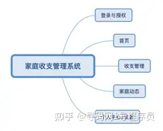
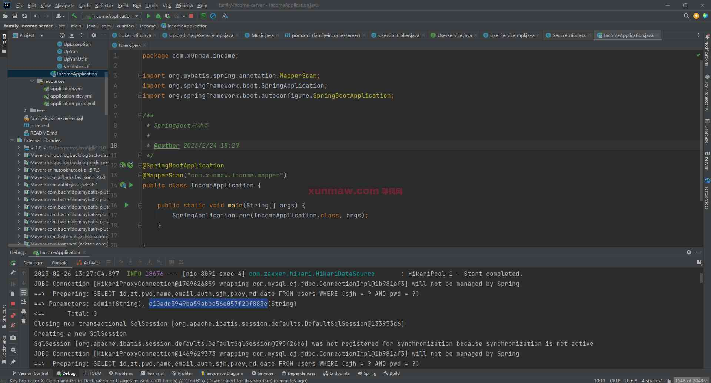
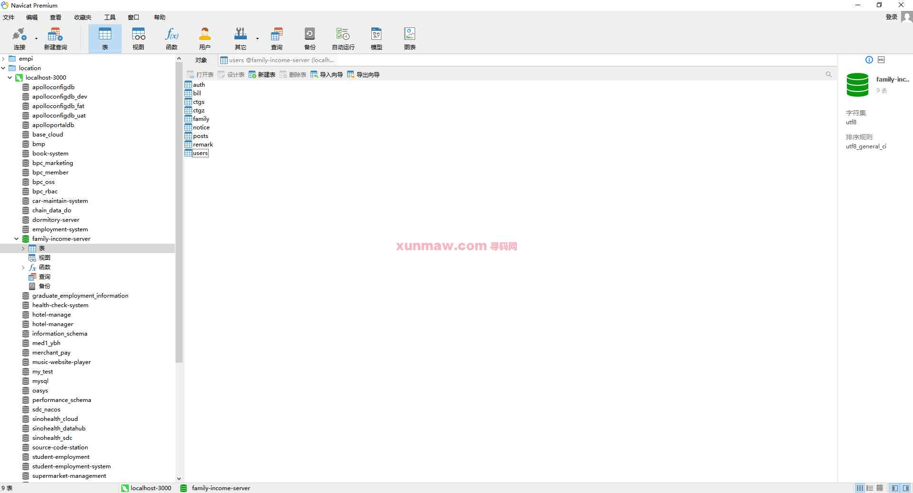
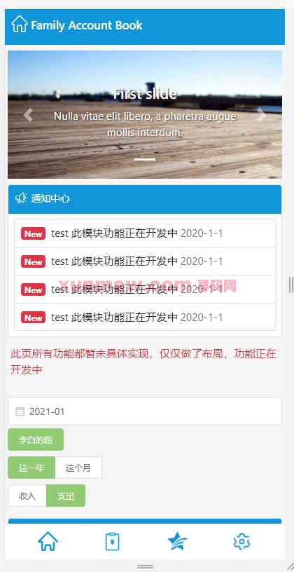
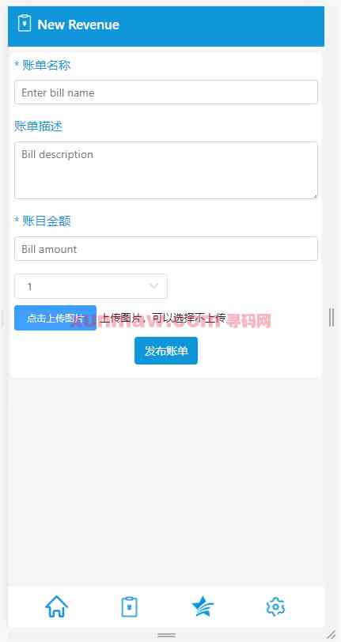

# 家庭收支系统

##  联系不到我，就看我的主页 
 
#### 介绍
基于springboot+vue实现的家庭收支管理系统，系统前后端分离，可用于家庭成员共同维护家庭收支数据，一同对家庭账户进行管理。代码的规范，部署简单，适宜二次编码

#### 软件架构
后端：springboot | mybatis-plus    
前端：vue | element-ui   
环境：mysql | maven | node  

#### 功能结构

#### 功能介绍
##### 【代码结构与数据库截图】
  

##### 【功能详述】 
△登录与授权  
通过手机号、密码登录系统，可以通过授权码加入家庭，加入家庭后可以维护家庭账户。  

△首页  
显示家庭账户统计数据。可以通过切换时间、家庭成员、收入、支出查看相应数据。通知中心支持开发为显示账户维护动态与家庭动态推送。  

△收支管理  
显示账户详细流水数据，可以按照家庭成员、时间段、收入支出类别查看数据。点击收入发布或支出发布，添加新的记账数据。  
收入或支出记账时需要填写账单名称、描述、金额，可以上传账单图片。  
  

△家庭动态  
可以发布或查看家庭成员动态。  

△个人中心/设置  
维护个人头像、名称等信息，查看家庭账户授权码。

 

#### 使用说明
1. 创建数据库，执行数据库脚本
2. 修改jdbc数据库连接参数
3. 下载安装maven依赖jar
4. 启动SpringBoot启动类

前端服务： 
    安装依拉： npm install  
    运行服务： npm run dev  

请求地址：  
    http://localhost:8081/family-income
    admin  
    123456